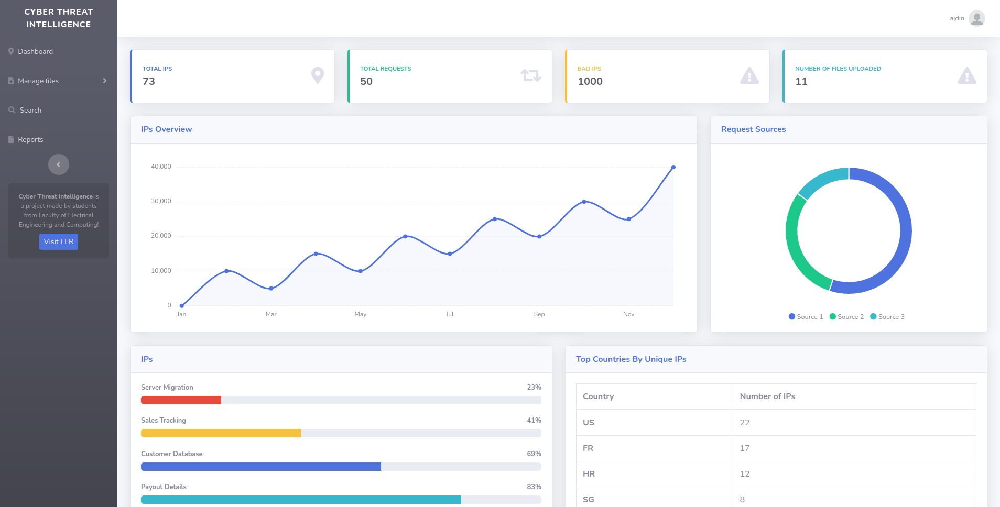
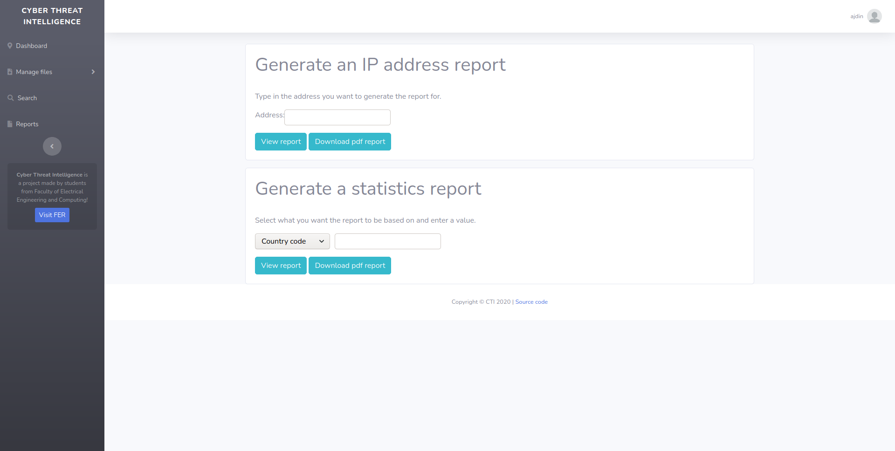
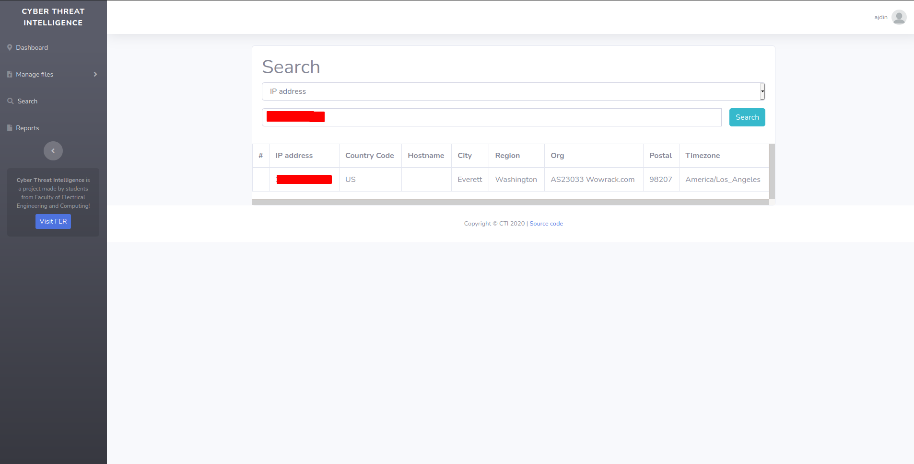

# Cyber Threat Intelligence

A Django application for analyzing Apache logs for possible Denial-of-service attacks.

## Screenshots





## Detecting Dos Attacks

//TODO

## How to run this app

1. Install Postgres, Python3 and Neo4J

On Ubuntu:

```
sudo apt install neo4j-client postgresql python3 python-is-python3
```

https://www.digitalocean.com/community/tutorials/how-to-install-and-configure-neo4j-on-ubuntu-20-04

2. Start the Postgres service and initialize the database cluster

For Arch Linux

```
$ sudo -iu postgres
$ initdb -D /var/lib/postgres/data
$ exit
```

For Fedora

```
$ /usr/bin/postgresql-setup --initdb
```

On Linux:

```
$ sudo systemctl start postgresql.service
```

3. Create a database "cti_db" in Postgres

```
$ sudo -iu postgres                     #switch to postgres user
$ psql                                  #enter psql as postgres user
psql (12.5)
Type "help" for help.

postgres=# CREATE DATABASE cti_db;
postgres=# CREATE USER cti_user WITH ENCRYPTED PASSWORD 'cti_password';
postgres=# GRANT ALL PRIVILEGES ON DATABASE cti_db TO cti_user;
```

4. Start neo4j database

```
Download neo4j from https://neo4j.com/download/
Fill out the form on the website with random data
Create new database with name 'django' and password 'password'
Start the database
```

5. Clone this repository and enter it

```
$ git clone https://github.com/ajdintrejic/cyber-threat-intelligence.git
$ cd cyber-threat-intelligence
```

6. Install the pip packages from requirements.txt

```
$ pip install -r requirements.txt
```

7. Enter the Django directory and migrate

```
$ cd django_project
$ python manage.py migrate
```

8. Start the server

```
$ python manage.py runserver
```

9. Create a superuser account

```
$ python manage.py createsuperuser
```

This will propmt for information like username, email and password.

The app should now be running http://localhost:8000 and you should be able to log into it with the credentials from step 9.

## Bug reporting

Please submit any bugs you encounter to GitHub Issues
